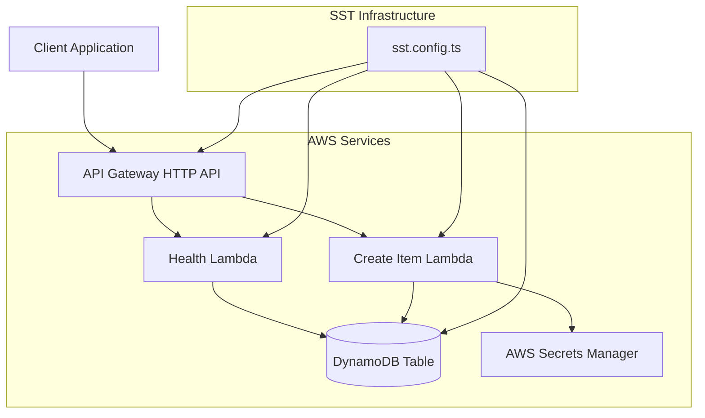

# Architecture Guide

This document provides a comprehensive overview of the SST backend template architecture, design patterns, and best practices.

## System Overview

The SST backend template implements a modern serverless architecture using AWS services and follows the single-table design pattern for DynamoDB.



## Core Components

### 1. API Gateway HTTP API

**Purpose**: Provides RESTful API endpoints with automatic OpenAPI documentation.

**Configuration**:
- **Routes**: Defined in `sst.config.ts`
- **CORS**: Enabled for cross-origin requests
- **Authentication**: Optional custom authorizer support
- **Documentation**: Automatic OpenAPI/Swagger generation

**Endpoints**:
- `GET /health` - Health check endpoint
- `POST /items` - Create new item

### 2. Lambda Functions

**Purpose**: Serverless compute for business logic.

**Functions**:
- **Health Function**: Simple health check with timestamp
- **Create Item Function**: Handles item creation with validation

**Configuration**:
- **Runtime**: Node.js 22.x
- **Memory**: Default (128MB for health, 1024MB for createItem)
- **Timeout**: Default (3 seconds for health, 30 seconds for createItem)
- **Environment Variables**: Injected via SST Resource binding

### 3. DynamoDB Table

**Purpose**: Primary data storage using single-table design pattern.

**Table Structure**:
```typescript
interface TableSchema {
  // Primary Key
  pk: string;  // Partition key (e.g., "ITEM#123", "USER#456")
  sk: string;  // Sort key (e.g., "ITEM#name", "USER#profile")
  
  // GSI1 - Alternative access patterns
  gsi1pk: string;  // GSI1 partition key
  gsi1sk: string;  // GSI1 sort key
  
  // Entity-specific attributes
  [key: string]: any;
}
```

**Access Patterns**:
- **Primary**: Query by `pk` and `sk`
- **GSI1**: Query by `gsi1pk` and `gsi1sk`
- **Flexible**: Support multiple entity types in single table

### 4. AWS Secrets Manager

**Purpose**: Secure storage of sensitive configuration data.

**Usage**:
- Database credentials
- API keys
- External service tokens
- Configuration secrets

## Data Model

### Single-Table Design

The template uses DynamoDB's single-table design pattern, which allows multiple entity types to coexist in one table.

#### Entity Types

**Items**:
```json
{
  "pk": "ITEM#123",
  "sk": "ITEM#name",
  "gsi1pk": "ITEM#category",
  "gsi1sk": "ITEM#2023-01-01T00:00:00.000Z",
  "name": "Test Item",
  "description": "A test item",
  "category": "electronics",
  "createdAt": "2023-01-01T00:00:00.000Z",
  "updatedAt": "2023-01-01T00:00:00.000Z"
}
```

**Users** (example):
```json
{
  "pk": "USER#456",
  "sk": "USER#profile",
  "gsi1pk": "USER#email@example.com",
  "gsi1sk": "USER#2023-01-01T00:00:00.000Z",
  "email": "user@example.com",
  "name": "John Doe",
  "role": "user",
  "createdAt": "2023-01-01T00:00:00.000Z",
  "updatedAt": "2023-01-01T00:00:00.000Z"
}
```

#### Access Patterns

1. **Get Item by ID**:
   ```typescript
   // Query: pk = "ITEM#123" AND sk = "ITEM#name"
   ```

2. **Get Items by Category**:
   ```typescript
   // GSI1 Query: gsi1pk = "ITEM#electronics"
   ```

3. **Get User by Email**:
   ```typescript
   // GSI1 Query: gsi1pk = "USER#email@example.com"
   ```

4. **Get Recent Items**:
   ```typescript
   // GSI1 Query: gsi1pk = "ITEM#electronics" AND gsi1sk > "ITEM#2023-01-01"
   ```

## Code Organization

### Directory Structure

```
src/
├── handlers/           # Lambda function handlers
│   └── http/          # HTTP API handlers
├── dal/               # Data Access Layer
├── libs/              # Utility libraries
└── types/             # TypeScript type definitions
```

### Handler Pattern

**Standard Handler Structure**:
```typescript
import { APIGatewayProxyHandlerV2 } from "aws-lambda";
import { ok, notOk500 } from "../../libs/response";

export const handler: APIGatewayProxyHandlerV2 = async (event) => {
  try {
    // 1. Parse and validate input
    // 2. Process business logic
    // 3. Call data layer
    // 4. Return response
    return ok(result);
  } catch (error) {
    console.error("Handler error:", error);
    return notOk500({ error: "Internal server error" });
  }
};
```

### Data Access Layer

**Repository Pattern**:
```typescript
// Generic repository functions
export const putItem = async (item: Record<string, any>) => { }
export const getItem = async (key: Record<string, any>) => { }
export const query = async (params: QueryCommandInput) => { }

// Typed functions for specific entities
export const createItem = async (item: Item) => { }
export const getItemById = async (pk: string, sk: string) => { }
```

### Response Helpers

**Standardized HTTP Responses**:
```typescript
export const ok = (data: any) => ({ statusCode: 200, ... })
export const notOk400 = (error: any) => ({ statusCode: 400, ... })
export const notOk500 = (error: any) => ({ statusCode: 500, ... })
```

## Environment Management

### Stage-Based Configuration

**Environment Files**:
- `.env.dev` - Local development
- `.env.test` - Test environment
- `.env.prod` - Production environment

**Environment Variables**:
```bash
# Required
AWS_REGION=eu-north-1
AWS_ACCOUNT=123456789012

# Optional
AUTHORIZER_ARN=arn:aws:lambda:eu-north-1:123456789012:function:my-existing-authorizer
SECRETS_ID=your-secrets-manager-secret-id
```

### SST Resource Binding

**Automatic Injection**:
- `TABLE_NAME` - DynamoDB table name
- `API_URL` - API Gateway URL
- Other resource ARNs and names

## Security Architecture

### Authentication & Authorization

**Current Implementation**:
- No authentication (template ready for custom authorizer)
- CORS enabled for cross-origin requests

**Recommended Additions**:
- Custom Lambda authorizer
- JWT token validation
- API key authentication
- AWS Cognito integration

### Data Security

**DynamoDB**:
- Encryption at rest (AES-256)
- Encryption in transit (TLS 1.2+)
- IAM-based access control

**Secrets Management**:
- AWS Secrets Manager for sensitive data
- Automatic rotation support
- IAM-based access control

**Network Security**:
- VPC endpoints (optional)
- Security groups
- Network ACLs

## Performance Considerations

### Lambda Optimization

**Cold Start Mitigation**:
- Provisioned concurrency for critical functions
- Connection pooling for database connections
- Minimal dependencies

**Memory Configuration**:
- Health function: 128MB (minimal)
- Create item function: 1024MB (with DynamoDB operations)

### DynamoDB Optimization

**Capacity Planning**:
- On-demand billing for variable workloads
- Provisioned capacity for predictable workloads
- Auto-scaling for provisioned tables

**Query Optimization**:
- Single-table design reduces cross-table queries
- GSI for alternative access patterns
- Batch operations for multiple items

### API Gateway Optimization

**Caching**:
- Response caching for GET endpoints
- TTL-based cache invalidation

**Compression**:
- Automatic response compression
- Minimum compression size: 1024 bytes

## Monitoring & Observability

### CloudWatch Integration

**Metrics**:
- Lambda invocations, errors, duration
- DynamoDB read/write capacity, throttling
- API Gateway requests, latency, errors

**Logs**:
- Lambda function logs
- API Gateway access logs
- Custom application logs

### Error Handling

**Structured Error Responses**:
```json
{
  "error": "Error message",
  "timestamp": "2023-01-01T00:00:00.000Z",
  "requestId": "unique-request-id"
}
```

**Error Categories**:
- 400: Bad Request (validation errors)
- 401: Unauthorized (authentication required)
- 403: Forbidden (insufficient permissions)
- 404: Not Found (resource not found)
- 500: Internal Server Error (unexpected errors)

## Scalability Patterns

### Horizontal Scaling

**Lambda**:
- Automatic scaling based on request volume
- Concurrent execution limits
- Reserved concurrency for critical functions

**DynamoDB**:
- Automatic scaling with on-demand billing
- Partition key design for even distribution
- GSI for alternative access patterns

**API Gateway**:
- Automatic scaling to handle traffic spikes
- Regional deployment for global access
- Edge caching for improved performance

### Vertical Scaling

**Lambda Memory**:
- Adjust memory allocation based on workload
- CPU allocation scales with memory
- Monitor and optimize based on metrics

**DynamoDB Capacity**:
- Provisioned capacity for predictable workloads
- Auto-scaling for variable workloads
- On-demand for unpredictable workloads

## Cost Optimization

### Resource Optimization

**Lambda**:
- Right-size memory allocation
- Optimize cold start duration
- Use provisioned concurrency judiciously

**DynamoDB**:
- Choose appropriate billing mode
- Optimize item size and access patterns
- Use DynamoDB Accelerator (DAX) for read-heavy workloads

**API Gateway**:
- Enable caching for GET endpoints
- Use appropriate timeout settings
- Monitor and optimize request patterns

### Development vs Production

**Development**:
- Minimal resources for cost efficiency
- On-demand billing for DynamoDB
- No provisioned concurrency

**Production**:
- Right-sized resources for performance
- Provisioned capacity for predictable workloads
- Monitoring and alerting enabled

## Best Practices

### Code Organization

1. **Separation of Concerns**: Handlers, business logic, and data access
2. **Type Safety**: Full TypeScript coverage
3. **Error Handling**: Comprehensive error handling and logging
4. **Testing**: Unit tests with AWS SDK mocking

### Infrastructure

1. **Infrastructure as Code**: All resources defined in `sst.config.ts`
2. **Environment Isolation**: Separate stages for different environments
3. **Resource Naming**: Consistent naming conventions
4. **Security**: Least privilege access and encryption

### Operations

1. **Monitoring**: CloudWatch metrics and alarms
2. **Logging**: Structured logging with correlation IDs
3. **Deployment**: Automated CI/CD with proper testing
4. **Documentation**: Keep architecture documentation updated

## Future Enhancements

### Potential Additions

1. **Authentication**: JWT-based authentication with Cognito
2. **Caching**: Redis/ElastiCache for session management
3. **File Storage**: S3 integration for file uploads
4. **Message Queues**: SQS/SNS for asynchronous processing
5. **Search**: OpenSearch for full-text search capabilities
6. **Analytics**: Kinesis for real-time data processing

### Architecture Evolution

1. **Microservices**: Split into domain-specific services
2. **Event-Driven**: Implement event sourcing patterns
3. **Multi-Region**: Deploy across multiple AWS regions
4. **Edge Computing**: Use Lambda@Edge for global performance

This architecture provides a solid foundation for building scalable, maintainable serverless applications while following AWS best practices and modern development patterns.
